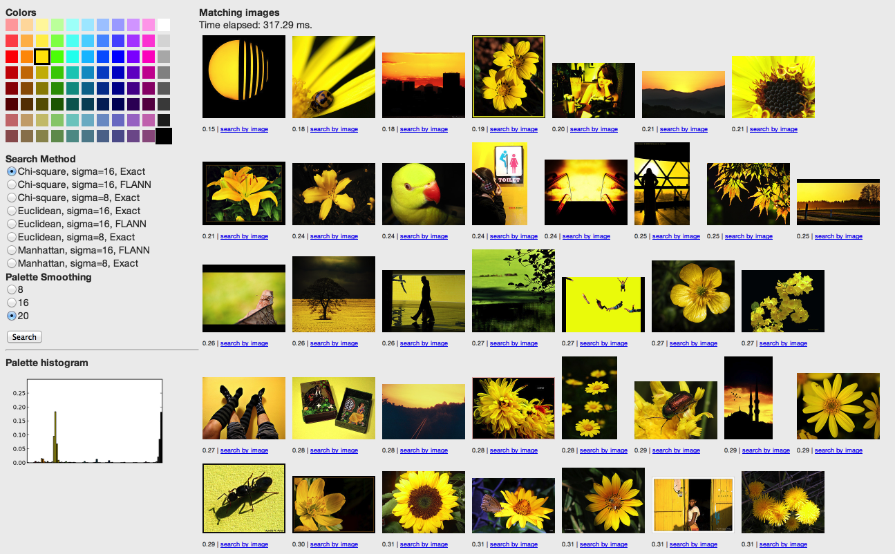
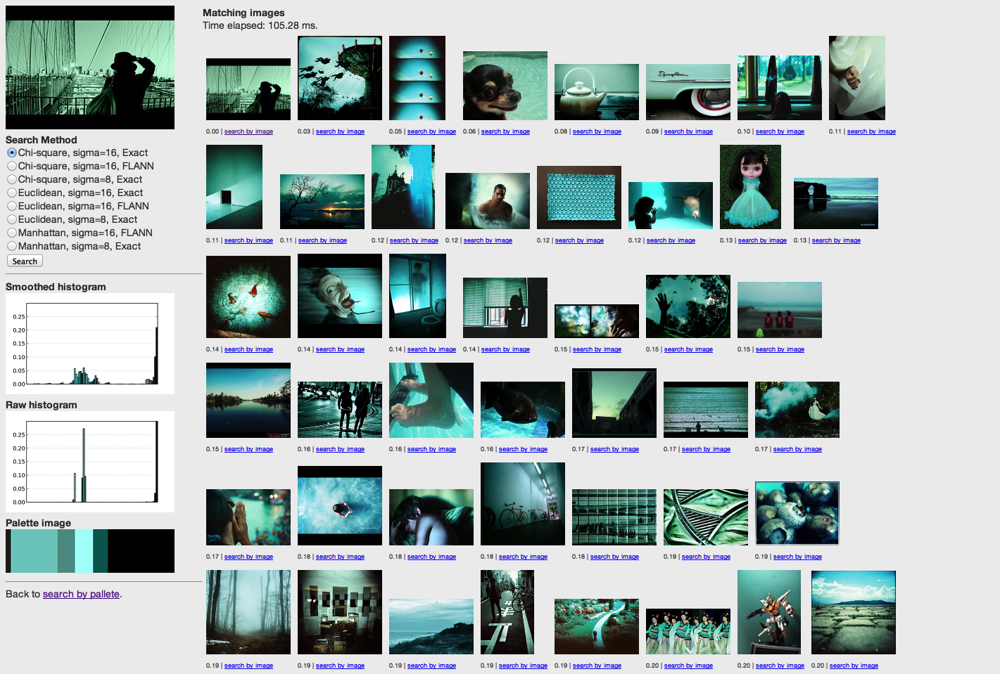
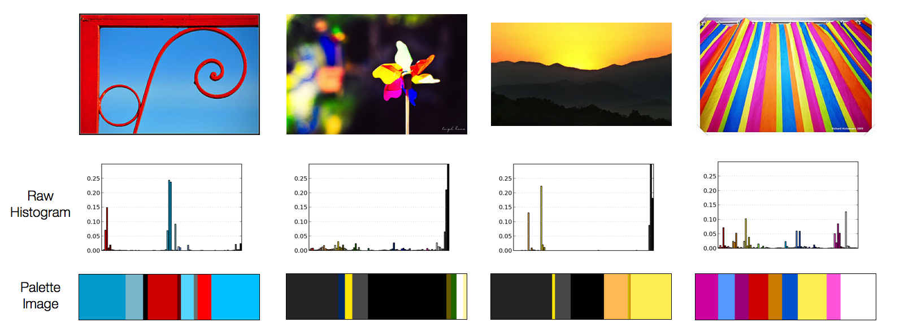
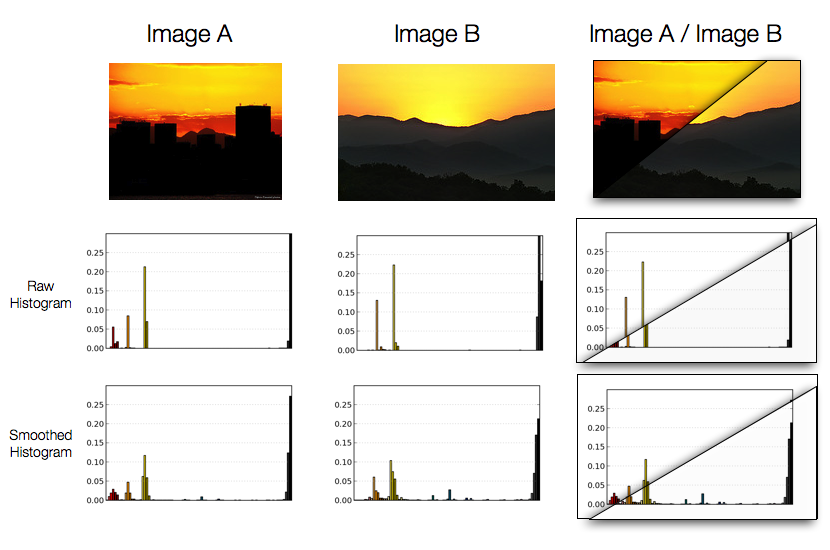
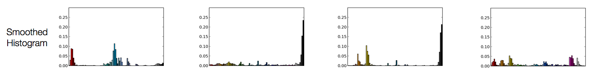
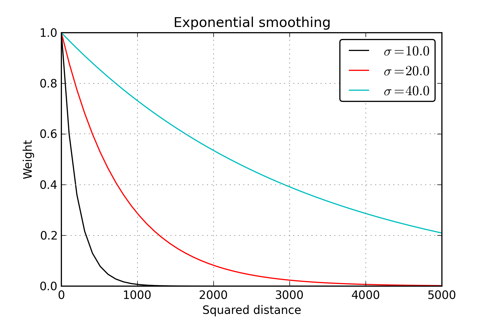
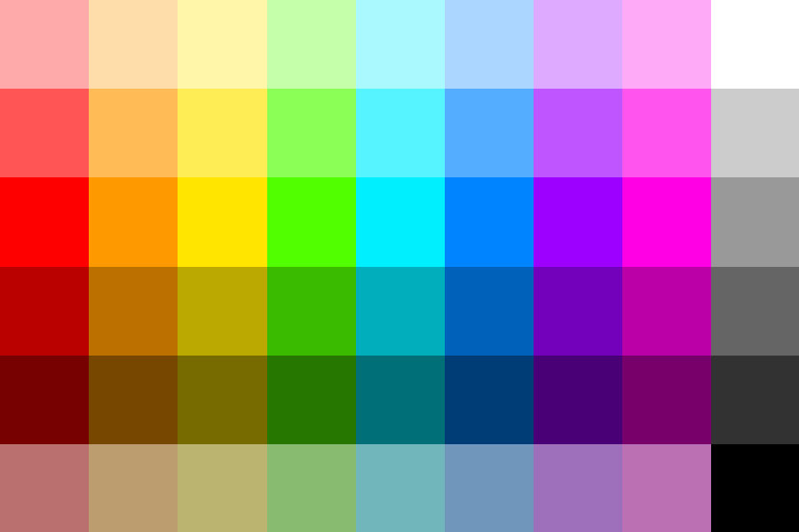
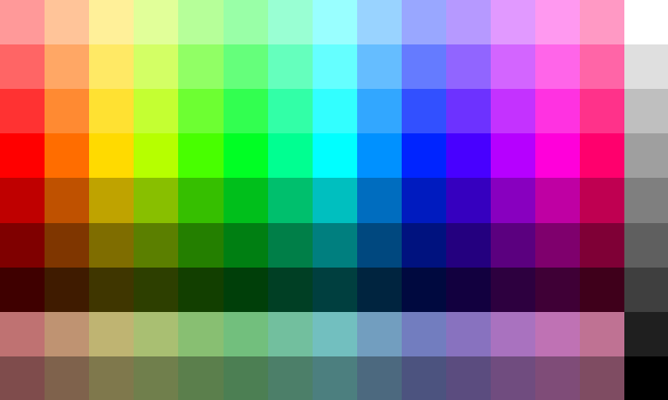

# Rayleigh: search images by multiple colors

## Introduction

We present an open-source system for quickly searching large image collections by multiple colors given as a palette, or by color similarity to a query image.
The system is running at [multicolorsearch.com](http://multicolorsearch.com).

### In brief

- Images are represented as histograms over a fixed palette of colors in CIELab space.
- Sets of colors used for searching are similarly represented as histograms.
- Similarity of images to other images and to a query set of colors is formulated in terms of distance between histograms.
- To make matching more robust to small differences in color, histograms are smoothed.

### System components

- The back end processes image URLs to extract color information to store in a searchable database.
- The web server provides REST access to the back end.
- The client provides the UI for selecting a color palette to search with, or an image, and requests data from the web server.

### Documentation

In addition to this high-level presentation, code is documented [here](singlehtml).

A public [Trello](https://trello.com/board/rayleigh/50d36a9e0f87f42952000276) contains current and archived tasks.

### Screenshots

 
Rayleigh in the search-by-palette view.

---

 
Rayleigh in the search-by-image view.

## Prior Art

<!--
    I'm having a difficult time understanding how the work you are detailing below will build on CBIR, Idee Labs Multicolr Search, or any of your other examples. Also, can you explain in an additional sentence how later research has closed the "semantic gap" in terms of nouns and verbs? Might be a lot to do in a post like this but I'd sort of like a state of the field description earlier on.

    Jessica
-->

The Content-Based Image Retrieval (CBIR) field has done much work on image similarity in the past couple of decades.
My brief impression of the field is that color similarity was initially seen as proxy for general visual similarity, not an end to itself.
More recent research focuses on closing the "semantic gap" in terms of nouns and verbs.

I was able to find two implementations of multi-color searching, both closed-source:

- the excellent [Idee Labs Multicolr Search](http://labs.tineye.com/multicolr), a rather expensive commercial service;
- an experiment called [Chromatik](http://chromatik.labs.exalead.com/).

There is an open-source project on top of Apache Lucene for general image retrieval, called [Lire](http://www.semanticmetadata.net/wiki/doku.php?id=lire:lire).
I have not tried it.

Additionally, a simple open-source implementation of a [single-color search](http://99designs.com/tech-blog/blog/2012/08/02/color-explorer/) was useful to see.

## Perception of Color

All visual perception is highly complex.
As countless optical illusions show,

- we perceive objects of the same actual size in the image as being [different sizes](http://www.illusionspoint.com/wp-content/uploads/2010/09/relative-size-optical-illusion-21.jpg);
- we see lines where there [aren't any](http://i.telegraph.co.uk/multimedia/archive/01121/300px-kanizsa-tria_1121094i.jpg);
- and most relevantly for this project, we see things that are the same color in the image as being [different colors](http://brainden.com/color-illusions.htm).

To get a machine to "see" the illusory contour of the triangle in the second example is an unsolved problem in practice.
If we were developing a system to search images by shape, we would struggle to return the Kanizsa Triangle above as a result for "triangle."

So it is with color.

- As artists have [long understood](http://www.amazon.com/Interaction-Color-Revised-Josef-Albers/dp/0300018460), how we see a color depends on what other colors are around it.

- As in the linked illusions above, the same color values in an image can be perceived as two different colors.

- Or conversely, we may perceive an object as being the same color in different images where its actual color is different (for example, you perceive your face to be the same color in an outdoors photograph, bathroom mirror, fluorescent office, and in the darkness of evening).

- On top of all this, there is a layer of language on top of all this mess:
different languages deliniate colors in slightly different ways (for example, Russian has two distinct colors of "blue"), and it has been shown that it actually [affects color perception](http://boingboing.net/2011/08/12/how-language-affects-color-perception.html).
    
## Representing Color

So the problem of searching images by color is hard, but we will still attempt it.
How should we represent "color" in the search engine?

### Human eye

In our eyes, there are two types of photorceptive cells: rods and cones.
Rods respond only to intensity of light, not its color, and are far more numerous.
Cones have three distinct types ('S', 'M', 'L'), each responding strongest to a specific wavelength of light.
Our perception of color is derived from the response rates of the photoreceptors, as well as our experience with colors and expectations.

 
Human retinal cell response curves. Image from Wikimedia Commons.

### RGB color space

On your computer, color is represented as three values, representing intensity of three color channels: red, green, and blue.
The pixels in the display are composed of these three basic lights.
When all are fully on, the color is white; when all are off, the color is black.
All of the millions of colors that a modern computer is able to display come from mixing the three intensities.

The RGB system can be thought of as describing a three dimensional space, with the Red, Green, and Blue dimensions.
A point in that space, given by the three coordinates, is a color.
We can begin to think of distances between colors in this way, as a distance in 3D space between two points.

 
RGB Color Cube. Image from Wikimedia Commons.

### HSV color space

An additive mixture of three distinct colors does not match our intutive model of how color works: we can't easily visualize the effect of adding red, green, or blue to a color.

Additionally, the distances in RGB spaces do not match up to perceptual judgements.
That is, a color may be quite far away from another one in terms of RGB coordinates, but humans will judge the two colors as quite similar.
Or the other way: two colors may *look* very different but be close together in RGB space.

The rainbow is what we usually visualize when we think of color: hues of the visible spectrum from the almost-infrared to the almost-ultraviolet, roughly divided into less than a dozen words.
A given hue can be imagined as more vibrant than baseline---deep red, midnight blue---or as more pastel-like---pink lipstick, robin's egg blue.

The Hue-Saturation-Value color space is informed by this mental model, and strives to have one dimension corresponding to our intuitive notion of hue, and two dimensions which set the vibrancy and lightness.
A point in HSV space is therefore more easily interpretable than a point in RGB space.

 
HSV Color Cone. Image from Wikimedia Commons.

### Perceptually uniform color spaces

Although it better matches our mental model of color, HSV space still suffers from a misalignment of perceptual judgements to 3D distance of colors.

The international standards agency has formulated an alternative color space with the explicit goal of making distances in the color space correspond to human judgments of color similarity.
Actually, it couldn't decide between two: CIELab and CIELuv.

CIELab, roughly, is formed by an oval with two axes: a and b, which correspond to the "opponent" colors of Yellow-Blue and Red-Green.
The third dimension of L\*a*b\* space is lightness, which is approximately self-describing.

As an aside, the "opponent" colors are so named because of the [opponent process](http://en.wikipedia.org/wiki/Opponent_process) theory, which posits that color perception comes not from the asbolute values but from the *difference* in activation rates of the three types of cones in the retina.
The opponent colors have no in-between point: we can imagine a point between blue and red, but not between blue and yellow; between red and yellow, but not between red and green; and so on.

In the L\*a*b\* space, simple Euclidean distance (\\(\sqrt{L^2 + a^2 + b^2}\\) between two colors, which corresponds to the intuitive notion of a distance between 3D points, is a good approximation to perceptual judgements of their difference.

 
CIELab color space. Image from couleur.org.

## Representing Multiple Colors

At this point, we understand that we should use the CIELab space to represent colors as 3D points, and can treat distances between them as corresponding to perceptual judgements.

But how do we represent a whole image, composed of many colors?

Our solution is to introduce a canonical *palette* of colors: a small set of colors that approximately cover the color space.
The color content of any image can then be represented as a histogram over the palette colors.
To construct the histogram, for each color in the palette we find the percentage of pixels in the image that are *nearest* (in terms of Euclidean distance) to that color.

We can represent this information in a slightly different way, by showing the top colors present in the image in a type of "palette image", with the area of a color in the palette image proportional to the prevalence of that color in the image.

 
Example of four images, their raw color histograms, and their "palette images."

### Similarity of color content

As described, we can represent the color content of an image with a histogram over a fixed palette, and note that images with similar color content should have similar histograms.

A natural measure of similarity between histograms is the amount of overlap.
Imagine superimposing one histogram on another; the areas that intersect form the overlap.

Now look at the third image above, of a sunset over dark hills.
The entirety of the sky seems to be in mostly two colors: a specific shade of yellow and a specific shade of light orange.

But what if another image of a sunset, very similar to us perceptually, has two colors that are just slightly different?
The histogram may in fact have no overlap at all then.

 
An example of two images that are very similar perceptually having different raw histograms.

### Smoothing histograms

The solution, as shown in the figure above, is to *smooth* the histograms---intuitively, spread the content of bins to nearby bins.
Note that the smoothed histograms look practically the same for the two images, even though the unsmoothed histograms have almost no overlap.

Therefore, our searchable representation of images will be in smoothed histograms.

 
 
Example of four images, their raw color histograms, their "palette images.", and their smoothed histograms.

We smooth histograms with a Gaussian kernel, with a parameter \\(\sigma\\) controlling the amount of smoothing.

 
Effect of sigma on the amount of smoothing.

Rayleigh offers a choice of a couple of settings of the sigma parameter.

### Histogram distance metrics

How should we measure the distance between two color histograms?

Let's say our canonical color palette has \\(K\\) colors.
The histogram over those colors can be thought of as a point (or vector) in \\(K\\)-dimensional space, with the value of dimension \\(k\\) corresponding to the amount of the \\(k\\)'th color of the palette in the image histogram.

**Euclidean** or \\(L_2\\) distance between two histograms \\(H\\) and \\(H'\\) is simply \\(\sqrt{\sum_{i=1}^K (H_i-H'_i)^2}\\) and corresponds to the intuitive notion of distance between the two vectors in \\(K\\)-dimensional space.
The calculation of this distance is quite fast due to its possible implementation as simple dot product, for which there are very fast system-level libraries.

A similar metric is **Manhattan** or \\(L_1\\) distance, which is simply \\(\sum_{i=1}^K \left|H_i-H'_i\right|\\).
A better distance metric for histograms is **Chi-squared** distance: \\(\sum_{i=1}^K \frac{(H_i - H'_i)^2}{H_i + H'_i}\\), or the **histogram intersection** distance: \\(\sum_{i=1}^K \min(H_i, H'_i)\\).

Rayleigh offers a choice between the first three distances.

## Forming the Palette

Recall that before we could represent an image as a histogram, we had to decide on the canonical colors of the histogram.
The palette should reasonably cover the space of all possible colors, and, as it will be used as part of the search-by-palette UI, should appear intuitively "correct."

Representing the 3D space of colors in two dimensions is a problem that has no fully correct solution.
My solution was to use the HSV color space and create a grid of colors by

1. picking N hues such that they span the 360 degrees of the color wheel, and presenting them as the middle row of the grid with full saturation and value.
2. for each hue, offering
    1. K variations by decreasing saturation
    2. K variations by decreasing lightness
    3. An additional K-1 variations by decreasing both saturation and lightness.
3. Add as many grayscale levels as there are variations, as the last column.

 
Palette of 8 hues and 2 variations.

 
Palette of 14 hues and 3 variations.

<!--
from skimage.io import imread, imshow, imsave
im = imread('doc/images/palette_14_3.png')
imsave('temp.png', scipy.misc.imresize(im, np.array(im.shape[:2])*50, interp='nearest'))
-->

## Constructing the dataset

All the components are now in place to construct a system that allows searching a large number of images by multiple colors, or by color similarity to another image.

We use the Flickr API to construct a large set of images.
A [particular API call](http://www.flickr.com/services/api/flickr.interestingness.getList.html) returns up to 500 most "interesting" images, as judged by an internal Flickr algorithm that is based on user actions such as Favorites, comments, and addition to sets for a given date.
We assemble a set of a million images using such calls (code is provided in this repository).

## Searching

Downloading and processing a million images is not trivial.
The images are loaded in parallel into a MongoDB database.
For each image, a raw histogram over the canonical color palette is computed and stored alongside image dimensions, url, and Flickr ID.
The pixel data is not stored, as we do not seek to replicate Flickr's data but point to it.

A searchable colection is formed from this data by loading all the raw histograms into a big matrix and smoothing them with a given parameter sigma.
The matrix forms the basis for the *Exact* search mode, where distances from the query to all images in the dataset are computed and the top K results are returned.

Rayleigh's color palette consists of \\(D=88\\) colors, and the current production version has \\(N=100K\\) images loaded.
This matrix easily fits in memory of even a basic computer, and so we can ignore disk seek effects and correctly estimate the cost of exact search as \\(O(DN)\\), as we have to look at all histograms and compute at least a dot product with each one.

There are two ways to speed this up:

1. Reduce the dimensionality of the data \\(D\\)
2. Provide an efficient index to the data; accept potentially inexact results.

### Dimensionality reduction

This speed-up does not yield us much, as the dimensionality of our data is already quite low.
Nevertheless, Rayleigh implements PCA-based dimensionality reduction that works quite well if you'd like to experiment with larger palettes.
An interesting question that I haven't looked at is what the PCA-reduced L\*a\*b\* colors look like.

### Indexing

A better approach is to construct an index to the data, such that we can quickly find all data points that have low distance to the query data point, without having to look through the entire dataset.

In addition to the Exact method above, Rayleigh implements SearchableImageCollection's using two packages.

[**cKDTree**](http://docs.scipy.org/doc/scipy/reference/generated/scipy.spatial.cKDTree.html) implements a standard data structure for such indexing tasks: the KD Tree, which splits the data in two, one dimension at a time, such that a group of nearest neighbors can quickly be found for a query.

[**Fast Library for Approximate Nearest Neighbors**](http://www.cs.ubc.ca/~mariusm/index.php/FLANN/FLANN) is solidly-developed research code that is used and partially developed by the impressive [Point Cloud Library](http://www.pointclouds.org) project.

The basic idea is automatic parameter tuning and comparison of two different methods for indexing data: multiple KD trees and hierarchical k-means.
Parameters are tuned such that the index is fast but can return inexact results.

We found that FLANN performs very well; since it includes kd trees, we did not extensively experiment with the cKDTree.

## System Architecture & Results

The separation of concerns of our application are:

- ImageCollection and SearchableImageCollection process images and construct index.

- Flask web app provides a REST interface to the SearchableImageCollection and some utility methods, such as plotting color histograms.

- HTML/JS UI is output by Flask, which fills in some things on the server side, but the search results are fetched with a separate AJAX call, to provide easy extension to loading multiple pages of results in a scrolling interface.

Please use the [demo](http://ec2-204-236-191-162.us-west-1.compute.amazonaws.com) and play around with different settings and color queries.

I would appreciate suggestions on how to effectively display a summary of results here.

## Next Steps

<!--
    For ease of reading, you might want to integrate a brief conclusion (one bullet point would suffice) into your next steps section (e.g. Conclusion and Next Steps). But I like things summarized and redundant so take that with a grain of salt... 

    Jessica
-->

- In constructing a histogram, weigh pixels by visual saliency. Often, the colors we perceive as important in the image actually do not take up much area and so are not well represented in the image histogram.

- Provide UI for adjusting percentages of each color in the palette query. No backend work is needed.

- How to represent "do-not-care" colors?

- Threshold-and-re-normalize the color histograms: cut off normalized histogram mass above some threshold, and re-normalize. This is a trick used in constructing the [SIFT descriptor](http://en.wikipedia.org/wiki/Scale-invariant_feature_transform#Keypoint_descriptor), for example.
